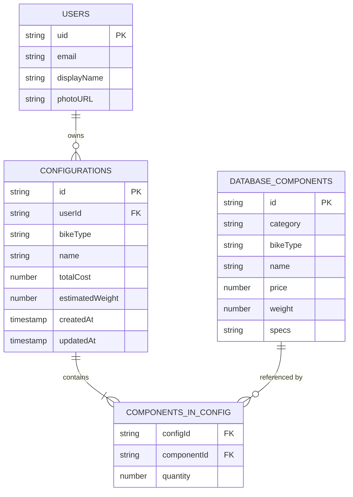

# 数据模型规范

## 概述

本文档定义 Veloform 项目中所有核心数据实体的结构、约束和关系。

---

## 核心实体

### 1. ConfigComponent

表示自行车配置中的单个组件。

**Schema**：

| 属性 | 类型 | 必填 | 约束 | 说明 |
|------|------|------|------|------|
| `id` | `string` | Yes | Unique, kebab-case | 唯一标识符（如 `'frame_road_sl8'`） |
| `category` | `string` | Yes | Enum | 组件类别 |
| `name` | `string` | Yes | Max 200 chars | 显示名称 |
| `price` | `number` | Yes | >= 0 | 价格（USD） |
| `weight` | `number` | Yes | > 0 | 重量（grams） |
| `bikeType` | `string` | No | `'Road' \| 'MTB' \| 'Fold'` | 关联车型 |

**Category 枚举值**：
- `Frame` - 车架
- `Drivetrain` - 传动系统
- `Wheelset` - 轮组
- `Suspension` - 悬挂（仅 MTB）
- `Cockpit` - 操控组件（车把、把立等）
- `Tires` - 轮胎

**示例**：

```typescript
const component: ConfigComponent = {
  id: 'drivetrain_road_duraace',
  category: 'Drivetrain',
  name: 'Shimano Dura-Ace Di2 R9200',
  price: 2800,
  weight: 1520,
  bikeType: 'Road'
};
```

**验证规则**：

```typescript
function validateComponent(comp: ConfigComponent): boolean {
  return (
    typeof comp.id === 'string' &&
    comp.id.length > 0 &&
    /^[a-z0-9_-]+$/.test(comp.id) &&
    typeof comp.category === 'string' &&
    VALID_CATEGORIES.includes(comp.category) &&
    typeof comp.name === 'string' &&
    comp.name.length <= 200 &&
    typeof comp.price === 'number' &&
    comp.price >= 0 &&
    typeof comp.weight === 'number' &&
    comp.weight > 0
  );
}
```

---

### 2. Configuration

表示用户保存的自行车构建配置。

**Schema**：

| 属性 | 类型 | 必填 | 约束 | 说明 |
|------|------|------|------|------|
| `id` | `string` | No | UUID v4 | Firestore 文档 ID |
| `userId` | `string` | Yes* | Firebase UID | 所有者 UID（服务器端设置） |
| `bikeType` | `string` | Yes | `'Road' \| 'MTB' \| 'Fold'` | 车型类别 |
| `name` | `string` | Yes | Max 200 chars | 构建名称 |
| `components` | `ConfigComponent[]` | Yes | Max 50 items | 选中组件列表 |
| `totalCost` | `number` | Yes | >= 0 | 总成本（USD） |
| `estimatedWeight` | `number` | Yes | > 0 | 估算重量（kg） |
| `createdAt` | `Timestamp` | No | Server timestamp | 创建时间 |
| `updatedAt` | `Timestamp` | No | Server timestamp | 更新时间 |

*\* 创建时由服务器自动设置*

**示例**：

```typescript
const configuration: Configuration = {
  id: 'cfg_abc123',
  userId: 'user_xyz789',
  bikeType: 'Road',
  name: 'S-Works Tarmac SL8 Build',
  components: [
    {
      id: 'frame_road_sl8',
      category: 'Frame',
      name: 'S-Works Tarmac SL8 Frame',
      price: 3500,
      weight: 795
    },
    {
      id: 'drivetrain_road_duraace',
      category: 'Drivetrain',
      name: 'Shimano Dura-Ace Di2 R9200',
      price: 2800,
      weight: 1520
    }
  ],
  totalCost: 8500,
  estimatedWeight: 6.8,
  createdAt: Timestamp.fromDate(new Date('2026-05-01')),
  updatedAt: Timestamp.fromDate(new Date('2026-05-01'))
};
```

**计算逻辑**：

```typescript
// Total cost calculation
totalCost = components.reduce((sum, c) => sum + c.price, 0);

// Estimated weight calculation (includes base frame weight)
const baseWeights: Record<string, number> = {
  Road: 0.9,   // 900g base frame
  MTB: 1.8,    // 1800g base frame
  Fold: 2.0    // 2000g base frame
};

const componentWeightKg = components.reduce(
  (sum, c) => sum + c.weight / 1000,
  0
);

estimatedWeight = baseWeights[bikeType] + componentWeightKg;
```

**不变量**：
1. `userId` 创建后不可修改
2. `createdAt` 创建后不可修改
3. `updatedAt` 每次更新时必须刷新为服务器时间
4. `components` 数组长度不超过 50
5. `totalCost` 必须等于所有组件价格之和
6. `estimatedWeight` 必须包含基础车架重量

---

### 3. DatabaseComponent

存储在 Firestore `components` collection 中的全局组件字典。

**Schema**：

| 属性 | 类型 | 必填 | 约束 | 说明 |
|------|------|------|------|------|
| `id` | `string` | Yes | Document ID | 文档 ID |
| `category` | `string` | Yes | Enum | 组件类别 |
| `bikeType` | `string` | Yes | `'Road' \| 'MTB' \| 'Fold'` | 关联车型 |
| `name` | `string` | Yes | Max 200 chars | 显示名称 |
| `price` | `number` | Yes | >= 0 | 价格（USD） |
| `weight` | `number` | Yes | > 0 | 重量（grams） |
| `specs` | `string` | Yes | Max 500 chars | 规格字符串 |

**与 ConfigComponent 的区别**：
- `DatabaseComponent` 包含 `specs` 字段
- `DatabaseComponent` 始终有 `bikeType`
- `ConfigComponent` 是用户配置中的快照，可能来自 DB 或自定义

**示例**：

```typescript
const dbComponent: DatabaseComponent = {
  id: 'frame_road_sl8',
  category: 'Frame',
  bikeType: 'Road',
  name: 'S-Works Tarmac SL8 Frame',
  price: 3500,
  weight: 795,
  specs: 'Carbon Fact 12r, OSBB, 12x142mm Thru-Axle'
};
```

---

## 默认数据集

### Road Bike 默认组件

| ID | Category | Name | Price | Weight | Specs |
|----|----------|------|-------|--------|-------|
| `frame_road_sl8` | Frame | S-Works Tarmac SL8 Frame | $3500 | 795g | Carbon Fact 12r |
| `drivetrain_road_duraace` | Drivetrain | Shimano Dura-Ace Di2 R9200 | $2800 | 1520g | 12-speed Electronic |
| `wheelset_road_clx64` | Wheelset | Roval CLX 64 | $2200 | 1370g | 64mm Deep Section |
| `cockpit_road_sl` | Cockpit | Specialized SL Stem/Bar | $450 | 320g | Integrated Carbon |

**Base Frame Weight**: 900g

---

### MTB 默认组件

| ID | Category | Name | Price | Weight | Specs |
|----|----------|------|-------|--------|-------|
| `frame_mtb_epic` | Frame | Epic World Cup Frame | $2800 | 1650g | FACT 12m Carbon |
| `drivetrain_mtb_xtr` | Drivetrain | Shimano XTR M9200 | $1800 | 1200g | 12-speed Mechanical |
| `suspension_mtb_sid` | Suspension | RockShox SID SL Ultimate | $1100 | 1450g | 120mm Travel |
| `wheelset_mtb_control` | Wheelset | Roval Control SL | $1800 | 1400g | 29" Carbon |

**Base Frame Weight**: 1800g

---

### Fold 默认组件

| ID | Category | Name | Price | Weight | Specs |
|----|----------|------|-------|--------|-------|
| `frame_fold_brompton` | Frame | Brompton T Line Frame | $4500 | 1850g | Titanium |
| `drivetrain_fold_internal` | Drivetrain | Brompton Internal 6-speed | $800 | 900g | Internal Gear Hub |
| `wheelset_fold_custom` | Wheelset | Brompton Custom Wheels | $600 | 800g | 16" Aluminum |

**Base Frame Weight**: 2000g

---

## 类型定义

### TypeScript Interfaces

```typescript
// src/app/types.ts

export type BikeType = 'Road' | 'MTB' | 'Fold';

export type ComponentCategory =
  | 'Frame'
  | 'Drivetrain'
  | 'Wheelset'
  | 'Suspension'
  | 'Cockpit'
  | 'Tires';

export interface ConfigComponent {
  id: string;
  category: ComponentCategory;
  name: string;
  price: number;
  weight: number; // grams
  bikeType?: BikeType;
}

export interface DatabaseComponent extends ConfigComponent {
  bikeType: BikeType; // Required in DB
  specs: string;
}

export interface Configuration {
  id?: string;
  userId?: string;
  bikeType: BikeType;
  name: string;
  components: ConfigComponent[];
  totalCost: number;
  estimatedWeight: number; // kg
  createdAt?: Timestamp;
  updatedAt?: Timestamp;
}
```

---

## ER 图



---

## 数据验证规则

### 客户端验证

```typescript
export function validateConfiguration(config: Partial<Configuration>): {
  valid: boolean;
  errors: string[];
} {
  const errors: string[] = [];

  // Bike type validation
  if (!config.bikeType || !['Road', 'MTB', 'Fold'].includes(config.bikeType)) {
    errors.push('Invalid bike type');
  }

  // Name validation
  if (!config.name || config.name.length === 0) {
    errors.push('Name is required');
  } else if (config.name.length > 200) {
    errors.push('Name must be less than 200 characters');
  }

  // Components validation
  if (!config.components || config.components.length === 0) {
    errors.push('At least one component is required');
  } else if (config.components.length > 50) {
    errors.push('Maximum 50 components allowed');
  }

  // Cost validation
  if (typeof config.totalCost !== 'number' || config.totalCost < 0) {
    errors.push('Total cost must be a non-negative number');
  }

  // Weight validation
  if (typeof config.estimatedWeight !== 'number' || config.estimatedWeight <= 0) {
    errors.push('Estimated weight must be a positive number');
  }

  return {
    valid: errors.length === 0,
    errors
  };
}
```

### 服务器端验证（Firestore Rules）

见 [Firestore API 规范](./firestore.md) 中的安全规则部分。

---

## 数据迁移策略

### Schema 版本控制

在 Configuration 中添加可选的 `schemaVersion` 字段：

```typescript
interface Configuration {
  // ... existing fields
  schemaVersion?: number; // Default: 1
}
```

### 迁移函数

```typescript
function migrateConfiguration(
  config: Configuration,
  fromVersion: number,
  toVersion: number
): Configuration {
  let migrated = { ...config };

  if (fromVersion === 1 && toVersion >= 2) {
    // Example: Add new field with default value
    migrated = {
      ...migrated,
      schemaVersion: 2,
      notes: migrated.notes || ''
    };
  }

  return migrated;
}
```

---

## 相关文档

- [Firestore API 规范](./firestore.md)
- [架构概览](../architecture/overview.md)
- [开发规范](../development/coding-standards.md)
