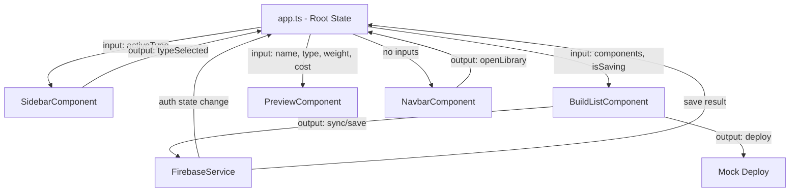
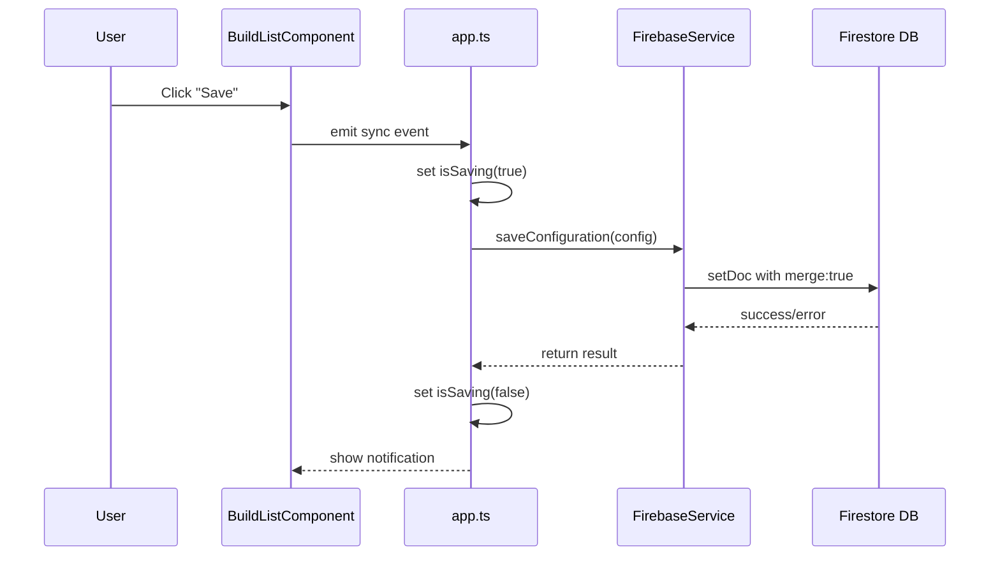
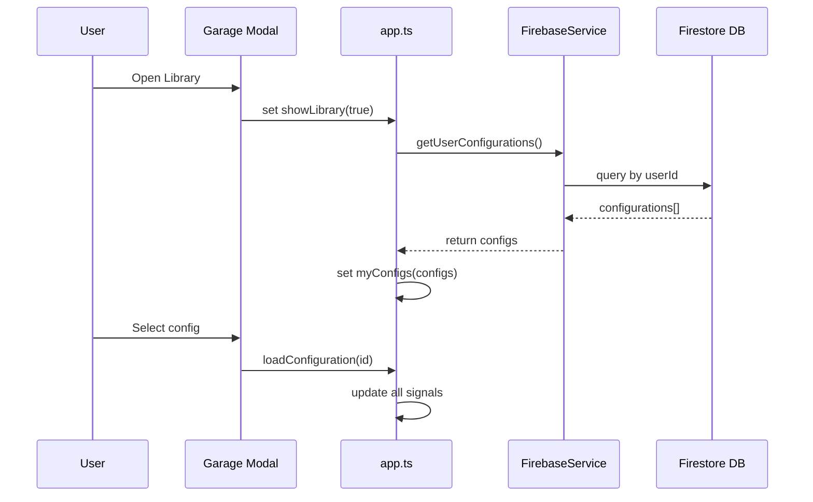

# 数据流设计

## 状态管理架构

Veloform 采用基于 Angular Signals 的单向数据流架构，确保状态变更的可预测性和可追踪性。

---

## 核心状态流

### 根组件状态 (app.ts)

根组件作为状态中枢，维护以下核心信号：

```typescript
// 车型选择
activeType = signal<'Road' | 'MTB' | 'Fold'>('Road');

// 组件列表
components = signal<ConfigComponent[]>(DEFAULT_ROAD_COMPONENTS);

// 用户认证状态
isLoggedIn = signal<boolean>(false);
user = signal<User | null>(null);

// UI 状态
isSaving = signal<boolean>(false);
showLibrary = signal<boolean>(false);
configId = signal<string | null>(null);

// 计算属性
totalCost = computed(() =>
  components().reduce((sum, c) => sum + c.price, 0)
);

baseWeight = computed(() => {
  const weights: Record<string, number> = { Road: 0.9, MTB: 1.8, Fold: 2.0 };
  return weights[activeType()];
});

totalWeight = computed(() => {
  const componentWeight = components().reduce(
    (sum, c) => sum + c.weight / 1000,
    0
  );
  return baseWeight() + componentWeight;
});
```

### 状态分发流程



---

## 组件间通信模式

### 1. Parent to Child (Input)

父组件通过 `input()` 向子组件传递数据：

```typescript
// PreviewComponent
name = input.required<string>();
type = input.required<'Road' | 'MTB' | 'Fold'>();
weight = input.required<number>();
cost = input.required<number>();
```

**使用场景**：
- 配置数据传递给预览组件
- 车型类型传递给侧边栏
- 保存状态传递给构建列表

### 2. Child to Parent (Output)

子组件通过 `output()` 向父组件发射事件：

```typescript
// SidebarComponent
typeSelected = output<'Road' | 'MTB' | 'Fold'>();

// 触发事件
onTypeSelect(type: 'Road' | 'MTB' | 'Fold') {
  this.typeSelected.emit(type);
}
```

**使用场景**：
- 用户选择车型
- 触发自定义对话框
- 通知父组件执行操作

### 3. Service-based State (Shared)

通过服务层共享跨组件状态：

```typescript
// FirebaseService
private _authState = signal<User | null>(null);
readonly authState = this._authState.asReadonly();

loginWithGoogle(): Promise<void> {
  // ... authentication logic
  this._authState.set(user);
}
```

**使用场景**：
- 用户认证状态
- 国际化语言设置
- 通知消息队列

---

## 副作用管理 (Effects)

Angular Effects 用于处理副作用和响应式订阅：

### 1. 认证状态监听

```typescript
effect(() => {
  const user = this.firebaseService.authState();
  this.isLoggedIn.set(!!user);
  this.user.set(user);

  if (user) {
    this.loadUserConfigurations();
  }
});
```

### 2. 车型切换时加载组件

```typescript
effect(() => {
  const type = this.activeType();
  this.loadComponentsForType(type);
});
```

### 3. 库模态框自动刷新

```typescript
effect(() => {
  if (this.showLibrary()) {
    this.refreshMyConfigs();
  }
});
```

---

## 数据持久化流

### 保存配置流程



### 加载配置流程



---

## 状态更新最佳实践

### ✅ 推荐做法

1. **使用不可变更新**：
   ```typescript
   // Good
   this.components.update(list => [...list, newComponent]);

   // Bad - 直接修改数组
   this.components().push(newComponent);
   ```

2. **批量更新相关状态**：
   ```typescript
   batch(() => {
     this.activeType.set(type);
     this.components.set(newComponents);
     this.configId.set(null);
   });
   ```

3. **使用 computed 派生状态**：
   ```typescript
   totalCost = computed(() =>
     this.components().reduce((sum, c) => sum + c.price, 0)
   );
   ```

### ❌ 避免的做法

1. **在 effects 中修改其他 signals**（会导致无限循环）
2. **直接在模板中调用函数计算**（每次变更检测都会执行）
3. **混用 RxJS 和 Signals 管理同一状态**（增加复杂度）

---

## 平台安全性

Three.js 和 DOM 操作需要平台安全检查：

```typescript
import { isPlatformBrowser } from '@angular/common';
import { inject, PLATFORM_ID } from '@angular/core';

export class PreviewComponent {
  private platformId = inject(PLATFORM_ID);

  ngOnInit() {
    if (isPlatformBrowser(this.platformId)) {
      this.initThreeJS();
    }
  }
}
```

---

## 相关文档

- [架构概览](./overview.md)
- [组件设计规范](./component-design.md)
- [开发规范](../development/coding-standards.md)
