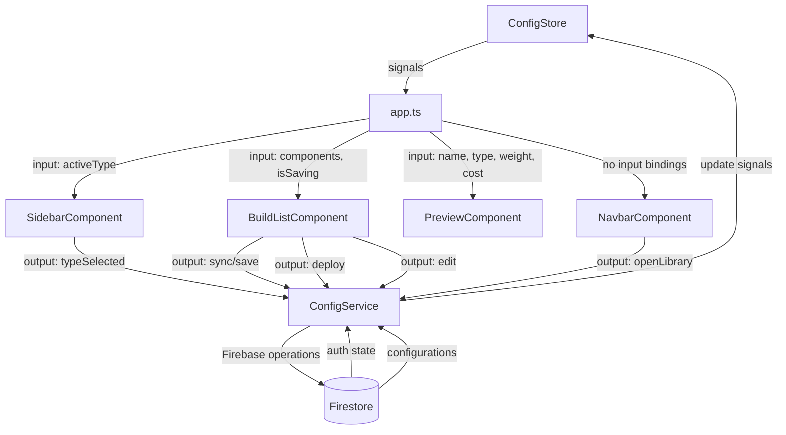
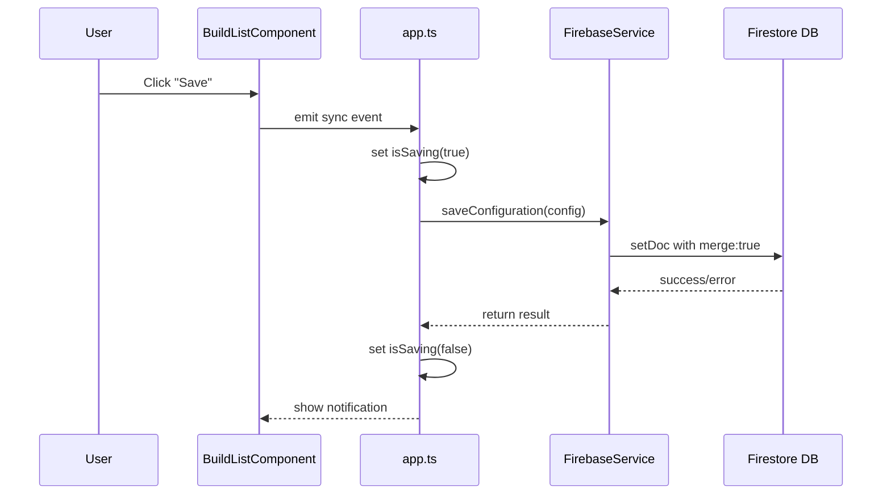
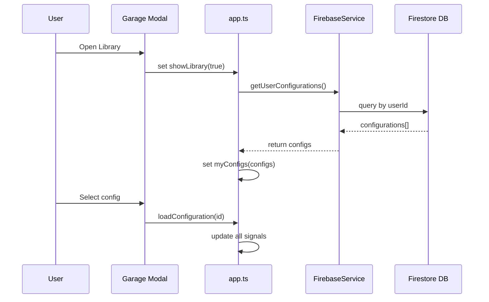

# 数据流设计

## 状态管理架构

Veloform 采用基于 Angular Signals 的单向数据流架构，使用 **ConfigStore** 和 **ConfigService** 实现中心化状态管理，确保状态变更的可预测性和可追踪性。

---

## 核心状态流

### ConfigStore 状态定义

```typescript
export interface ConfigState {
  activeType: BikeType;           // 当前选中车型
  components: ConfigComponent[];  // 当前配置组件列表
  configId: string | null;        // 当前配置 ID（已保存时）
  manualConfigName: string | null;// 用户自定义配置名称
  allDbComponents: ConfigComponent[]; // 数据库组件缓存
  showLibrary: boolean;           // 是否显示配置库模态框
  myConfigs: Configuration[];     // 用户保存的配置列表
  isLoggedIn: boolean;            // 用户登录状态
  isSaving: boolean;              // 保存操作进行中
  showComponentSelector: boolean; // 是否显示组件选择器
  editingComponentId: string;     // 当前编辑的组件 ID
}

// 默认状态
const DEFAULT_STATE: ConfigState = {
  activeType: 'Road',
  components: [...ROAD_DEFAULTS],
  configId: null,
  manualConfigName: null,
  allDbComponents: [],
  showLibrary: false,
  myConfigs: [],
  isLoggedIn: false,
  isSaving: false,
  showComponentSelector: false,
  editingComponentId: '',
};
```

### 计算属性

```typescript
// 配置名称（支持国际化）
configName = computed(() => {
  const manual = this.state().manualConfigName;
  if (manual) return manual;
  const lang = currentLang();
  const key = this.state().activeType === 'Road' ? 'bike.name.road' : 
              this.state().activeType === 'MTB' ? 'bike.name.mtb' : 'bike.name.fold';
  return translations[lang][key] || key;
});

// 总成本
totalCost = computed(() =>
  this.state().components.reduce((acc, c) => acc + c.price, 0)
);

// 基础车架重量（克）
baseWeight = computed(() => {
  switch (this.state().activeType) {
    case 'Road': return 900;
    case 'MTB': return 1800;
    case 'Fold': return 2000;
  }
});

// 总重量（千克）
totalWeight = computed(() => {
  const compWeight = this.state().components.reduce((acc, c) => acc + c.weight, 0);
  return (this.baseWeight() + compWeight) / 1000;
});
```

### 状态分发流程



---

## 组件间通信模式

### 1. Parent to Child (Input)

父组件通过 `input()` 向子组件传递数据：

```typescript
// PreviewComponent
name = input.required<string>();
type = input.required<'Road' | 'MTB' | 'Fold'>();
weight = input.required<number>();
cost = input.required<number>();
```

**使用场景**：
- 配置数据传递给预览组件
- 车型类型传递给侧边栏
- 保存状态传递给构建列表

### 2. Child to Parent (Output)

子组件通过 `output()` 向父组件发射事件：

```typescript
// SidebarComponent
typeSelected = output<'Road' | 'MTB' | 'Fold'>();

// 触发事件
onTypeSelect(type: 'Road' | 'MTB' | 'Fold') {
  this.typeSelected.emit(type);
}
```

**使用场景**：
- 用户选择车型
- 触发组件编辑对话框
- 触发配置保存和部署操作

### 3. Service-based State (Shared)

通过 **ConfigStore** 和 **ConfigService** 实现中心化状态管理：

```typescript
// ConfigStore - 状态容器
export class ConfigStore {
  private state = signal<ConfigState>({ ...DEFAULT_STATE });
  
  // 只读信号
  readonly activeType = computed(() => this.state().activeType);
  readonly components = computed(() => this.state().components);
  readonly isLoggedIn = computed(() => this.state().isLoggedIn);
  
  // 更新方法
  setActiveType(type: BikeType) {
    this.state.update(s => ({ ...s, activeType: type }));
  }
  
  replaceComponent(oldId: string, newComponent: ConfigComponent) {
    this.state.update(s => ({
      ...s,
      components: s.components.map(c => c.id === oldId ? newComponent : c),
    }));
  }
}

// 单例导出
export const configStore = new ConfigStore();
```

**使用场景**：
- 用户认证状态（通过 ConfigStore 管理）
- 当前配置状态（组件列表、车型类型等）
- UI 状态（模态框显示/隐藏）

### 4. 服务驱动模式

通过单例服务驱动模态框组件：

```typescript
// ConfirmDialogService
class ConfirmDialogService {
  private isOpen = signal(false);
  private options = signal<ConfirmDialogOptions | null>(null);
  
  confirm(options: ConfirmDialogOptions): Promise<boolean> {
    return new Promise((resolve) => {
      this.options.set(options);
      this.isOpen.set(true);
      this.resolveCallback = resolve;
    });
  }
}

// 单例导出
export const confirmDialogService = new ConfirmDialogService();
```

**使用场景**：
- 确认对话框（删除操作确认）
- 通知系统（toast 消息）

---

## 副作用管理 (Effects)

Angular Effects 用于处理副作用和响应式订阅。在本项目中，Effects 主要在根组件 `app.ts` 中使用：

### 1. 配置库自动刷新

当用户登录且显示库模态框时，自动刷新配置列表：

```typescript
// app.ts
effect(() => {
  const loggedIn = configStore.isLoggedIn();
  if (loggedIn && configStore.showLibrary()) {
    configService.refreshMyConfigs();
  }
});
```

### 2. 认证状态监听

通过 Firebase Auth 状态变化更新登录状态：

```typescript
// config.service.ts
initAuthListener() {
  onAuthStateChanged(auth, (user) => {
    configStore.setIsLoggedIn(!!user);
  });
}
```

### 3. 组件选择器监听

在 `PreviewComponent` 中监听车型变化以更新 3D 渲染：

```typescript
// preview.ts
effect(() => {
  const currentType = this.type();
  if (isPlatformBrowser(this.platformId) && this.bikeGroup) {
    this.buildBikeMesh(currentType);
  }
});
```

---

## 数据持久化流

### 保存配置流程



### 加载配置流程



---

## 状态更新最佳实践

### ✅ 推荐做法

1. **使用不可变更新**：
   ```typescript
   // Good
   this.components.update(list => [...list, newComponent]);

   // Bad - 直接修改数组
   this.components().push(newComponent);
   ```

2. **批量更新相关状态**：
   ```typescript
   batch(() => {
     this.activeType.set(type);
     this.components.set(newComponents);
     this.configId.set(null);
   });
   ```

3. **使用 computed 派生状态**：
   ```typescript
   totalCost = computed(() =>
     this.components().reduce((sum, c) => sum + c.price, 0)
   );
   ```

### ❌ 避免的做法

1. **在 effects 中修改其他 signals**（会导致无限循环）
2. **直接在模板中调用函数计算**（每次变更检测都会执行）
3. **混用 RxJS 和 Signals 管理同一状态**（增加复杂度）

---

## 平台安全性

Three.js 和 DOM 操作需要平台安全检查：

```typescript
import { isPlatformBrowser } from '@angular/common';
import { inject, PLATFORM_ID } from '@angular/core';

export class PreviewComponent {
  private platformId = inject(PLATFORM_ID);

  ngOnInit() {
    if (isPlatformBrowser(this.platformId)) {
      this.initThreeJS();
    }
  }
}
```

---

## 相关文档

- [架构概览](./overview.md)
- [组件设计规范](./component-design.md)
- [开发规范](../development/coding-standards.md)
