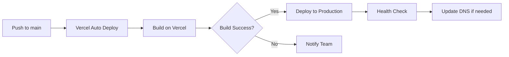

# 部署与环境配置规范

## 概述

本文档定义 Veloform 项目的部署流程、环境配置和监控策略。

---

## 环境分类

| 环境 | 用途 | URL | 访问权限 |
|------|------|-----|----------|
| **Development** | 本地开发 | `http://localhost:3000` | 开发者 |
| **Staging** | 预发布测试 | `https://staging.veloform.app` | 内部团队 |
| **Production** | 生产环境 | `https://veloform.app` | 公开 |

---

## Vercel 部署配置

### vercel.json

```json
{
  "framework": "angular",
  "buildCommand": "npm run build",
  "outputDirectory": "dist/app/browser",
  "rewrites": [
    {
      "source": "/(.*)",
      "destination": "/index.html"
    }
  ],
  "headers": [
    {
      "source": "/(.*).(js|css|woff2)",
      "headers": [
        {
          "key": "Cache-Control",
          "value": "public, max-age=31536000, immutable"
        }
      ]
    }
  ]
}
```

### 部署流程



**步骤**：
1. 推送代码到 `main` 分支
2. Vercel 自动触发构建
3. 执行 `npm run build`
4. 部署静态文件到 CDN
5. 验证部署成功

---

## 环境变量管理

### .env.example

```bash
# Firebase Configuration
FIREBASE_API_KEY=your_api_key_here
FIREBASE_AUTH_DOMAIN=your_project.firebaseapp.com
FIREBASE_PROJECT_ID=your_project_id
FIREBASE_STORAGE_BUCKET=your_project.appspot.com
FIREBASE_MESSAGING_SENDER_ID=your_sender_id
FIREBASE_APP_ID=your_app_id

# Google Gemini AI (optional)
GEMINI_API_KEY=your_gemini_key

# Application URL
APP_URL=https://veloform.app
```

### 本地开发设置

```bash
# 1. Copy template
cp .env.example .env

# 2. Fill in actual values
# Edit .env with your Firebase credentials

# 3. Start dev server
npm run dev
```

### Vercel 环境变量配置

在 Vercel Dashboard 中设置：
1. 进入项目 Settings > Environment Variables
2. 添加所有必需变量
3. 选择适用环境（Production / Preview / Development）
4. 保存并重新部署

**注意**：`.env` 文件已被 `.gitignore` 排除，切勿提交到版本控制。

---

## SSR 部署（可选）

### Express Server 配置

**server.ts**：

```typescript
import 'zone.js/node';
import { APP_BASE_HREF } from '@angular/common';
import { CommonEngine } from '@angular/ssr/node';
import express from 'express';
import { fileURLToPath } from 'node:url';
import { dirname, join, resolve } from 'node:path';
import bootstrap from './src/main.server';

const serverDistFolder = dirname(fileURLToPath(import.meta.url));
const browserDistFolder = resolve(serverDistFolder, '../browser');
const indexHtml = join(serverDistFolder, 'index.server.html');

const app = express();
const commonEngine = new CommonEngine();

app.set('view engine', 'html');
app.set('views', browserDistFolder);

// Serve static files
app.get('*.*', express.static(browserDistFolder, {
  maxAge: '1y'
}));

// All regular routes use the Angular engine
app.get('*', (req, res, next) => {
  const { protocol, originalUrl, baseUrl, headers } = req;

  commonEngine
    .render({
      bootstrap,
      documentFilePath: indexHtml,
      url: `${protocol}://${headers.host}${originalUrl}`,
      publicPath: browserDistFolder,
      providers: [{ provide: APP_BASE_HREF, useValue: baseUrl }],
    })
    .then((html) => res.send(html))
    .catch((err) => next(err));
});

function run(): void {
  const port = process.env['PORT'] || 4000;
  app.listen(port, () => {
    console.log(`Node Express server listening on http://localhost:${port}`);
  });
}

run();
```

### 运行 SSR 服务

```bash
# Build for SSR
npm run build

# Start Node.js server
npm run serve:ssr:app
```

**生产环境建议**：
- 使用 PM2 进行进程管理
- 配置 Nginx 反向代理
- 启用 HTTPS（Let's Encrypt）

---

## Firebase 配置

### firebase-applet-config.json

```json
{
  "apiKey": "YOUR_API_KEY",
  "authDomain": "YOUR_PROJECT.firebaseapp.com",
  "projectId": "YOUR_PROJECT_ID",
  "storageBucket": "YOUR_PROJECT.appspot.com",
  "messagingSenderId": "YOUR_SENDER_ID",
  "appId": "YOUR_APP_ID"
}
```

**安全提醒**：
- 此文件包含占位符，实际配置通过环境变量注入
- 不要提交真实的 Firebase 密钥到仓库
- 使用 Firebase App Check 保护 API

### Firestore 安全规则部署

```bash
# Install Firebase CLI
npm install -g firebase-tools

# Login
firebase login

# Deploy rules
firebase deploy --only firestore:rules
```

---

## 构建优化

### Bundle Budget 检查

**angular.json**：

```json
{
  "projects": {
    "app": {
      "architect": {
        "build": {
          "configurations": {
            "production": {
              "budgets": [
                {
                  "type": "initial",
                  "maximumWarning": "1.5MB",
                  "maximumError": "2MB"
                },
                {
                  "type": "anyComponentStyle",
                  "maximumWarning": "4kB",
                  "maximumError": "8kB"
                }
              ]
            }
          }
        }
      }
    }
  }
}
```

### Tree-shaking 优化

**确保可 tree-shake**：

```typescript
// ✅ Good - Pure function (can be tree-shaken)
export function calculateWeight(components: ConfigComponent[]): number {
  return components.reduce((sum, c) => sum + c.weight, 0);
}

// ❌ Bad - Side effect (cannot be tree-shaken)
console.log('This module is loaded');
```

### 懒加载路由

```typescript
// app.routes.ts
export const routes: Routes = [
  {
    path: 'library',
    loadComponent: () => import('./components/library').then(m => m.LibraryComponent)
  }
];
```

---

## 性能监控

### Core Web Vitals 目标

| 指标 | 目标值 | 测量工具 |
|------|--------|----------|
| LCP (Largest Contentful Paint) | < 2.5s | Lighthouse |
| FID (First Input Delay) | < 100ms | Web Vitals Extension |
| CLS (Cumulative Layout Shift) | < 0.1 | PageSpeed Insights |
| FCP (First Contentful Paint) | < 1.8s | Chrome DevTools |

### Lighthouse CI

```yaml
# .github/workflows/lighthouse.yml
name: Lighthouse CI

on: [pull_request]

jobs:
  lighthouse:
    runs-on: ubuntu-latest
    steps:
      - uses: actions/checkout@v3

      - name: Setup Node.js
        uses: actions/setup-node@v3
        with:
          node-version: '20'

      - name: Install dependencies
        run: npm ci

      - name: Build
        run: npm run build

      - name: Run Lighthouse
        uses: treosh/lighthouse-ci-action@v9
        with:
          urls: |
            http://localhost:3000
          budgetPath: ./lighthouse-budget.json
          uploadArtifacts: true
```

---

## 错误追踪

### Sentry 集成（推荐）

```typescript
// app.config.ts
import * as Sentry from '@sentry/angular';

export const appConfig: ApplicationConfig = {
  providers: [
    {
      provide: ErrorHandler,
      useValue: Sentry.createErrorHandler({
        showDialog: true,
      }),
    },
    {
      provide: TraceService,
      useClass: TraceService,
    },
  ]
};

// Initialize Sentry
Sentry.init({
  dsn: 'https://your-dsn@sentry.io/project-id',
  integrations: [
    new Sentry.BrowserTracing({
      tracePropagationTargets: ['localhost', 'https://veloform.app'],
      routingInstrumentation: Sentry.routingInstrumentation,
    }),
  ],
  tracesSampleRate: 1.0,
});
```

---

## 回滚策略

### Vercel 回滚

1. 进入 Vercel Dashboard
2. 选择项目 > Deployments
3. 找到上一个稳定版本
4. 点击 "Promote to Production"

### 手动回滚

```bash
# Checkout previous stable commit
git checkout <stable-commit-hash>

# Revert problematic commit
git revert <bad-commit-hash>

# Push to trigger redeployment
git push origin main
```

---

## SEO 优化

### 元标签配置

**index.html**：

```html
<!DOCTYPE html>
<html lang="en">
<head>
  <meta charset="utf-8">
  <title>Veloform - Advanced Bike Configurator v3.1.1</title>
  <meta name="description" content="Design your dream bicycle with real-time 3D preview. Configure Road, MTB, and Folding bikes with premium components.">

  <!-- Open Graph -->
  <meta property="og:title" content="Veloform - Advanced Bike Configurator">
  <meta property="og:description" content="Design your dream bicycle with real-time 3D preview">
  <meta property="og:type" content="website">
  <meta property="og:url" content="https://veloform.app">
  <meta property="og:image" content="https://veloform.app/og-image.jpg">

  <!-- Canonical URL -->
  <link rel="canonical" href="https://veloform.app">

  <!-- JSON-LD Structured Data -->
  <script type="application/ld+json">
  {
    "@context": "https://schema.org",
    "@type": "WebApplication",
    "name": "Veloform",
    "description": "Advanced bicycle configurator with 3D preview",
    "url": "https://veloform.app",
    "applicationCategory": "DesignApplication",
    "operatingSystem": "Web Browser",
    "offers": {
      "@type": "Offer",
      "price": "0",
      "priceCurrency": "USD"
    }
  }
  </script>
</head>
<body>
  <app-root></app-root>
</body>
</html>
```

### SSR Prerender 配置

**app.config.server.ts**：

```typescript
export const config: ApplicationConfig = {
  providers: [
    provideServerRendering(withPrerendering([
      { path: '/', renderMode: RenderMode.Prerender },
      { path: '/road', renderMode: RenderMode.Prerender },
      { path: '/mtb', renderMode: RenderMode.Prerender },
      { path: '/fold', renderMode: RenderMode.Prerender }
    ]))
  ]
};
```

---

## 部署检查清单

### 部署前

- [ ] 所有测试通过（`npm run test`）
- [ ] Lint 检查通过（`npm run lint`）
- [ ] 构建成功（`npm run build`）
- [ ] Bundle size 在预算内
- [ ] 环境变量已配置
- [ ] CHANGELOG.md 已更新
- [ ] 版本号已递增

### 部署后

- [ ] 验证生产 URL 可访问
- [ ] 检查核心功能正常工作
- [ ] 验证 Firebase 连接
- [ ] 测试用户认证流程
- [ ] 检查错误追踪上报
- [ ] 运行 Lighthouse 审计
- [ ] 监控 Core Web Vitals

---

## 相关文档

- [架构概览](../architecture/overview.md)
- [API 规范](../api/firestore.md)
- [开发规范](../development/coding-standards.md)
